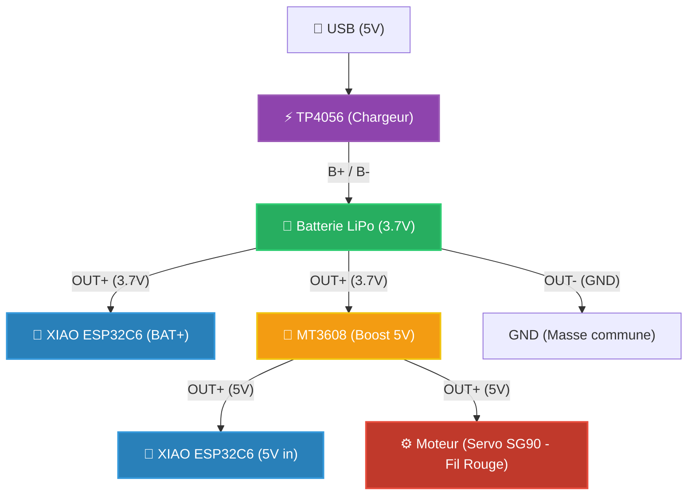
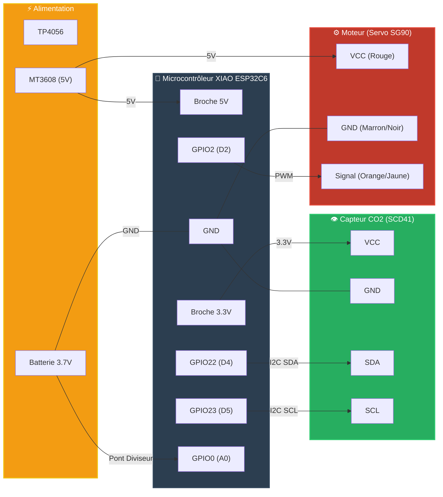
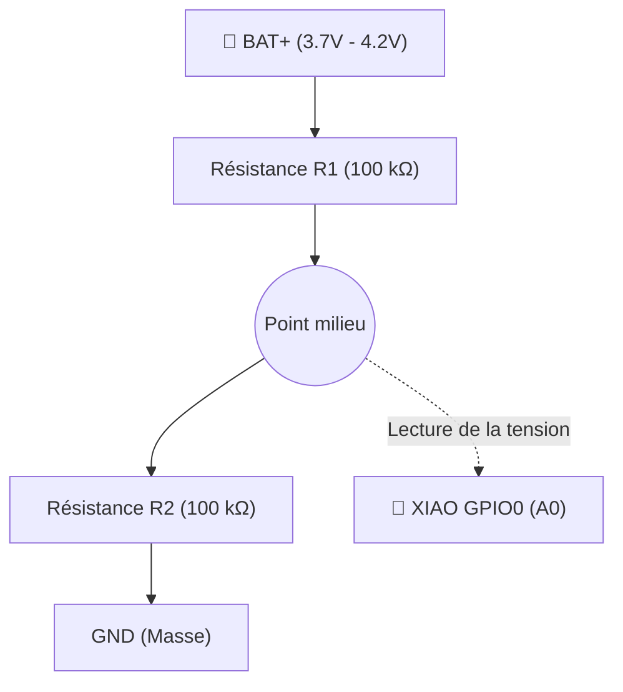

# 🐦 Birdie DIY — Moniteur de qualité d'air open source

> **Reproduction DIY du projet [Birdie® Fresh Air Monitor™](https://birdie.design/fr)** — un indicateur visuel de qualité d'air basé sur le CO2, inspiré du canari des mineurs. Lorsque l'air est bon, l'oiseau se dresse. Lorsque le CO2 dépasse un seuil, il s'abaisse pour vous signaler d'ouvrir les fenêtres.

***

## 📖 À propos du projet

[Birdie®](https://birdie.design/fr) est un produit commercial primé qui utilise un capteur CO2 suisse pour indiquer la qualité de l'air intérieur via une aiguille mobile en forme d'oiseau. Ce dépôt est une **implémentation DIY open source** de ce concept.

La logique de déclenchement est fidèle à l'originale :
- L'oiseau **descend** après **10 minutes consécutives** au-dessus de **1000 ppm** (pas instantanément, pour éviter les faux positifs)
- L'oiseau **remonte** dès que le CO2 repasse sous **950 ppm** (hystérésis de 50 ppm pour éviter les oscillations)

***

## ✨ Fonctionnement

```
CO2 < 950 ppm   → oiseau en haut  (air excellent)
CO2 > 1000 ppm  → oiseau en bas   (aérez !)
  (après 10 min consécutives au-dessus du seuil)
```

Inspiré du canari des mineurs : autrefois, les mineurs emmenaient un canari dans les mines pour détecter les gaz toxiques. Birdie® transpose ce principe à la maison moderne.

***

## 🧰 Matériel nécessaire

| Composant | Référence | Rôle |
|---|---|---|
| Microcontrôleur | XIAO ESP32C6 (Seeed Studio) | Cerveau du projet, Wi-Fi, ESPHome |
| Capteur CO2 | Sensirion SCD41 | CO2, température, humidité (I2C) |
| Servo | SG90 | Indicateur visuel (aiguille oiseau) |
| Chargeur batterie | TP4056 avec protection (DW01A) | Charge LiPo via USB-C/micro-USB |
| Boost converter | MT3608 | Monte la tension 3.7 V → 5 V pour le servo |
| Batterie | LiPo 1S 3.7 V – 3800 mAh | Alimentation principale |
| R1 | 100 kΩ | Pont diviseur batterie (bras haut) |
| R2 | 100 kΩ | Pont diviseur batterie (bras bas) |
| Câbles Dupont | — | Connexions |

***

## 🔌 Schéma d'alimentation

La chaîne d'alimentation fonctionne ainsi :



> ⚠️ **Régler le MT3608 en premier** : avant de connecter quoi que ce soit, ajuster le trimmer du MT3608 à **5.0 V** avec un multimètre. Ne jamais dépasser 5.5 V sur le XIAO ou le SG90.

***

## 🔧 Câblage complet

### Tableau récapitulatif

| Signal | GPIO XIAO | Broche XIAO | Connecté à |
|---|---|---|---|
| I2C SDA | GPIO22 | D4 | SCD41 SDA |
| I2C SCL | GPIO23 | D5 | SCD41 SCL |
| Servo signal | GPIO2 | D2 | SG90 fil orange/jaune |
| ADC batterie | GPIO0 | A0 | Point milieu R1/R2 |
| Alimentation | — | 5V | MT3608 OUT+ et SG90 rouge |
| Alimentation | — | GND | Masse commune |
| SCD41 VCC | — | 3V3 | SCD41 VCC |

### Schéma de câblage


> **Note :** La masse (GND) doit être commune à tous les composants.

### Pont diviseur — mesure batterie



| Tension batterie | Tension lue sur A0 |
|---|---|
| 4.2 V (pleine) | ~2.1 V |
| 3.7 V (mi-charge) | ~1.85 V |
| 3.2 V (vide) | ~1.6 V |

***

## ⚡ Versions du firmware ESPHome

Deux versions du firmware sont disponibles dans `esphome/` :

### v1 — Position proportionnelle au CO2

La v1 (`v1.yaml`) mappe **linéairement** la position du servo sur la concentration de CO2 :
- Sous 700 ppm → oiseau tout en haut
- Au-dessus de 1400 ppm → oiseau tout en bas
- Entre 700 et 1400 ppm → position intermédiaire proportionnelle

Le deep sleep réveille l'ESP toutes les **5 minutes** pour prendre une mesure.

> **Avantage :** comportement progressif et intuitif, on voit l'oiseau bouger graduellement.  
> **Inconvénient :** ne reproduit pas la logique exacte du Birdie® original, et consomme plus (réveil fréquent, mesure toutes les 15s).

### v2 — Logique fidèle au Birdie® original ✅ (recommandée)

La v2 (`v2.yaml`) reproduit exactement le comportement du produit commercial :
- L'oiseau est en **position haute** ou **basse**, jamais intermédiaire
- Il descend uniquement après **10 minutes consécutives** au-dessus de 1000 ppm
- Il remonte uniquement si le CO2 passe sous **950 ppm** (hystérésis)
- Un compteur global persistant (`minutes_above_threshold`) survit aux cycles de deep sleep grâce à `restore_value: true`
- Le deep sleep réveille l'ESP toutes les **minutes** pour tenir le compteur à jour, avec endormissement long la nuit (22h–7h)

> **Avantage :** comportement identique au Birdie® original, robuste aux faux positifs.  
> **Inconvénient :** légèrement plus complexe à lire, et l'autonomie dépend directement de la durée du deep sleep.

### Comparatif v1 / v2

| Aspect | v1 | v2 |
|---|---|---|
| Position du servo | Proportionnelle (continu) | Tout-ou-rien (haut/bas) |
| Logique de seuil | Instantanée (CO2 direct) | 10 min consécutives > 1000 ppm |
| Hystérésis | Non | Oui (950 ppm à la remontée) |
| Fidélité au Birdie® | Partielle | Exacte ✅ |
| Intervalle de réveil | 5 min | 1 min (actif) / nuit longue |
| Deep sleep nocturne | Oui (22h–7h) | Oui (22h–7h) |
| Compteur persistant | Non | Oui (`restore_value`) |
| Complexité du code | Simple | Modérée |

> 💡 **Recommandation** : utiliser la v2 pour un comportement fidèle à l'original. Utiliser la v1 si vous préférez un indicateur visuel graduel ou souhaitez expérimenter.

***

## 🚀 Comment flasher le code sur le XIAO ESP32C6

Le code de ce projet utilise **ESPHome**. Voici les étapes simples pour l'installer sur votre carte XIAO :

### Méthode 1 : Via ESPHome Web (La plus simple, sans installation)
1. Branchez votre XIAO ESP32C6 à votre ordinateur via un câble USB-C (assurez-vous qu'il permet le transfert de données).
2. Ouvrez le navigateur **Google Chrome** ou **Microsoft Edge** et allez sur [ESPHome Web](https://web.esphome.io/).
3. Cliquez sur **Connect** et sélectionnez le port série de votre XIAO dans la fenêtre qui s'ouvre.
4. Cliquez sur **Install** puis choisissez le fichier de configuration de ce dépôt (ex: `esphome/v2.yaml`).
5. Renseignez vos identifiants Wi-Fi lorsque cela vous est demandé.
6. Attendez la fin de la compilation et du flashage. Votre oiseau est prêt !

### Méthode 2 : Via Home Assistant (Si vous l'utilisez déjà)
1. Ouvrez Home Assistant et allez dans le module complémentaire **ESPHome**.
2. Créez un nouvel appareil (bouton **New Device**).
3. Nommez-le (ex: `birdie-diy`) et choisissez la plateforme **ESP32-C6**.
4. Copiez le contenu de `esphome/v2.yaml` (ou modifiez-le selon vos besoins) et collez-le dans l'éditeur de configuration du nouvel appareil.
5. Branchez le XIAO à la machine hébergeant Home Assistant, ou utilisez la méthode *Plug into this computer* pour flasher via le navigateur.
6. Cliquez sur **Install** et patientez pendant la création du firmware.

***

## 🏠 Home Assistant — Conserver la dernière valeur

Quand l'ESP est en deep sleep, les entités passent à `unavailable`. Ces **template sensors** conservent la dernière valeur connue et évitent les trous dans les graphiques.


***

## 🔒 Déploiement Docker — ESPHome Dashboard

Pour héberger ESPHome dans Docker derrière un reverse proxy (Traefik, NGINX, etc.) :

```yaml
services:
  esphome:
    container_name: esphome
    image: ghcr.io/esphome/esphome:latest
    environment:
      - USERNAME=admin
      - PASSWORD=motdepassefort        # ⚠️ À changer absolument
    volumes:
      - /opt/docker/esphome:/config
      - /etc/localtime:/etc/localtime:ro
    restart: unless-stopped
networks:
  default:
    name: proxy
    external: true
```

> ⚠️ **Sécurité** : penser aussi à changer le mot de passe du fallback AP (`BirdieDIYFallback`) dans les fichiers YAML ESPHome avant de flasher. La valeur par défaut `12345678` est volontairement simpliste pour les tests.

***

## 📊 Entités Home Assistant disponibles

| Entité | Type | Unité |
|---|---|---|
| `sensor.qualite_air_xiao_co2` | CO2 temps réel | ppm |
| `sensor.qualite_air_xiao_temperature` | Température temps réel | °C |
| `sensor.qualite_air_xiao_humidite` | Humidité temps réel | % |
| `sensor.co2_derniere_valeur` | CO2 (dernière valeur connue) | ppm |
| `sensor.temperature_derniere_valeur` | Température (dernière valeur connue) | °C |
| `sensor.humidite_derniere_valeur` | Humidité (dernière valeur connue) | % |
| `sensor.qualite_air_xiao_batterie_tension` | Tension batterie *(optionnel, nécessite R1/R2)* | V |
| `sensor.qualite_air_xiao_batterie_pourcentage` | % batterie *(optionnel, nécessite R1/R2)* | % |
| `sensor.qualite_air_xiao_etat_birdie` | État textuel (v2 uniquement) | — |

***

## ⏱️ Autonomie estimée

| Composant | Consommation estimée |
|---|---|
| XIAO ESP32C6 actif + Wi-Fi | ~30 mA |
| SCD41 mesure périodique | ~15 mA |
| SG90 pendant mouvement | ~10–20 mA |
| MT3608 (actif) | ~2–5 mA quiescent |
| **Total en fonctionnement** | ~55–70 mA |
| Deep sleep (nuit) | < 1 mA |
| **Autonomie estimée (batterie 3800 mAh)** | **~2 à 3 jours** |

**Pour améliorer l'autonomie :**
- Augmenter l'intervalle de réveil (15 min au lieu de 5 min en v1, ou plus de 1 min en v2 si les mesures de nuit ne sont pas nécessaires)
- Désactiver le MT3608 la nuit avec un transistor (économise ~2–5 mA en continu)
- Utiliser une batterie LiPo plus grande (6000–10000 mAh)
- Désactiver l'API ESPHome si Home Assistant n'est pas utilisé en permanence

***

## 🖨️ Pièces imprimées en 3D

Les fichiers STL/3MF sont dans le dossier [`/parts/`](./parts/).

| Fichier | Description |
|---|---|
| `parts/boitier_principal.stl` | Corps principal du Birdie DIY |
| `parts/support_mural.stl` | Support pour montage mural |
| `parts/oiseau_aiguille.stl` | Aiguille en forme d'oiseau fixée sur le servo |
| `parts/couvercle.stl` | Couvercle arrière du boîtier |

> Paramètres d'impression conseillés : PLA, 0.2 mm de couche, 20% de remplissage, supports activés pour le boîtier.

***

## 📁 Structure du dépôt

```
birdie-diy/
├── README.md                        ← Ce fichier
├── esphome/
│   ├── v1.yaml                      ← Firmware v1 (position proportionnelle)
│   └── v2.yaml                      ← Firmware v2 (logique Birdie® exacte, recommandée)
├── homeassistant/
│   └── templates.yaml               ← Template sensors HA
├── docker/
│   └── docker-compose.yml           ← Config Docker ESPHome
└── parts/
    ├── boitier_principal.stl
    ├── support_mural.stl
    ├── oiseau_aiguille.stl
    └── couvercle.stl
```

***

## 🆚 Birdie DIY vs Birdie® original

| Aspect | Birdie® original | Birdie DIY |
|---|---|---|
| **Prix** | ~149 € | ~15–25 € (composants) |
| **Capteur CO2** | Sensirion (suisse, non communiqué) | Sensirion SCD41 (même fabricant) |
| **Connectivité** | Bluetooth uniquement | Wi-Fi + Home Assistant |
| **Application** | App Birdie® propriétaire | Home Assistant (open source) |
| **Seuil descente** | > 1000 ppm pendant > 10 min | Identique ✅ (v2) |
| **Seuil remontée** | < 950 ppm (hystérésis) | Identique ✅ (v2) |
| **Mouvement oiseau** | Mécanique breveté, silencieux | Servo SG90 (léger bruit) |
| **Alimentation** | Pile AAA ou secteur | LiPo rechargeable via USB-C |
| **Design boîtier** | Design danois primé | Impression 3D DIY |
| **Personnalisation** | Aucune | Code open source modifiable |
| **Notifications** | Via app Birdie® | Via Home Assistant (mobile, email…) |
| **Historique données** | Limité | Complet via Home Assistant |
| **Autonomie** | ~6 mois (pile AAA) | ~2–3 jours (optimisable) |

La principale différence est la **connectivité** : Birdie® original fonctionne en Bluetooth avec une application propriétaire, tandis que cette version DIY utilise le Wi-Fi et s'intègre à Home Assistant — ce qui ouvre l'historique des mesures, les automatisations et les notifications, des fonctionnalités absentes du produit original.

***

## 📝 Licence

Ce projet est open source sous licence **MIT**.  
Il n'est pas affilié à Birdie® ou Birdie Design ApS.  
Pour le produit original : [birdie.design](https://birdie.design/fr)

***

## 🙏 Crédits

- Concept original : [Birdie® Fresh Air Monitor™](https://birdie.design/fr) — Birdie Design ApS (Danemark)
- Capteur CO2 : [Sensirion SCD41](https://sensirion.com/products/catalog/SCD41) (Suisse)
- Firmware : [ESPHome](https://esphome.io)
- Home Assistant : [home-assistant.io](https://www.home-assistant.io)